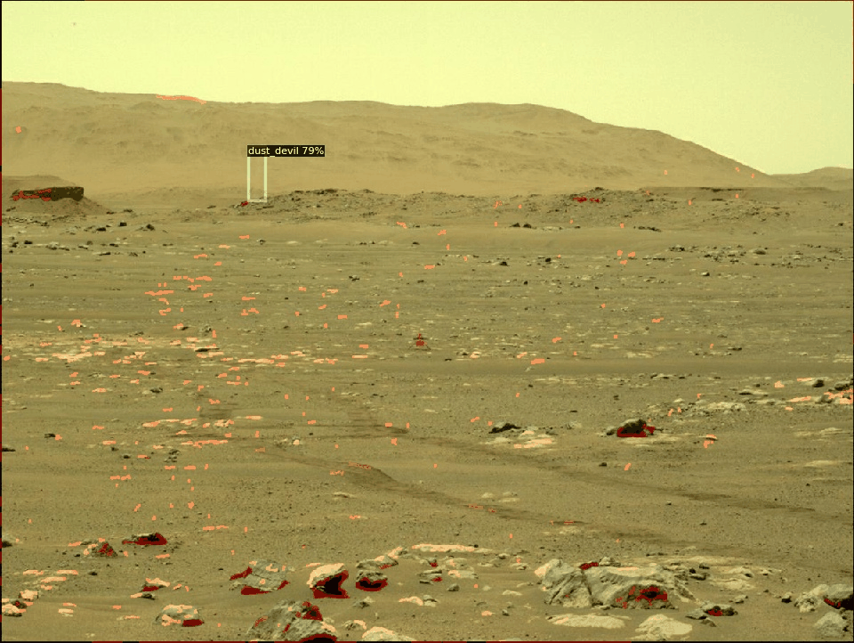
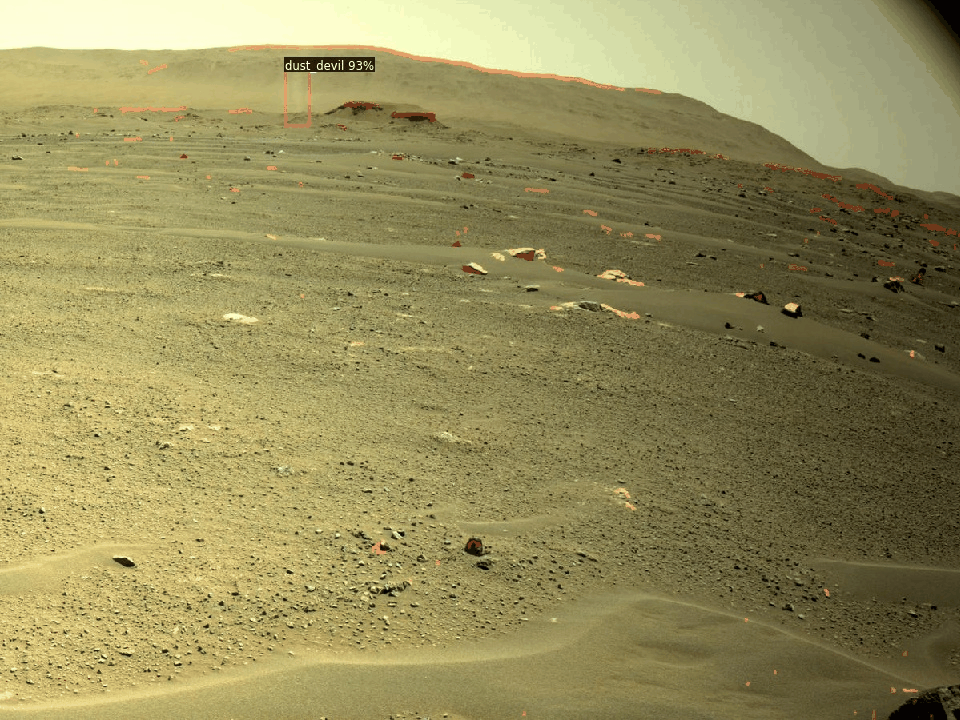
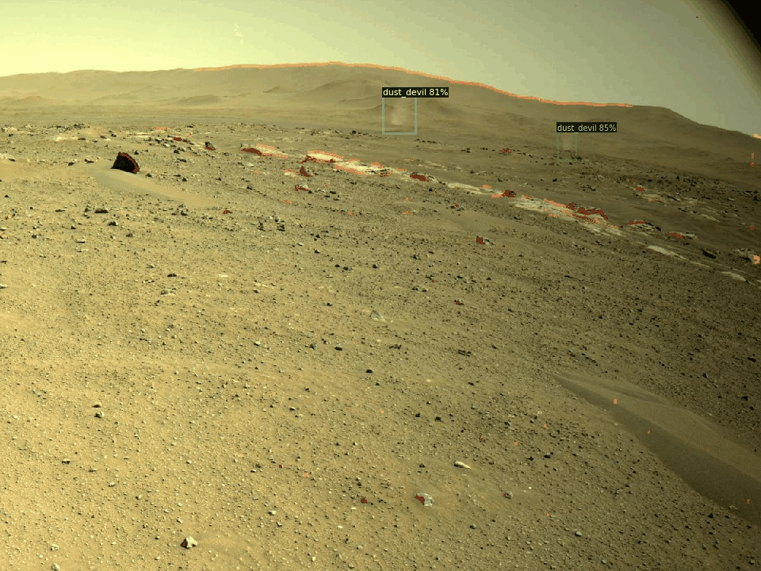
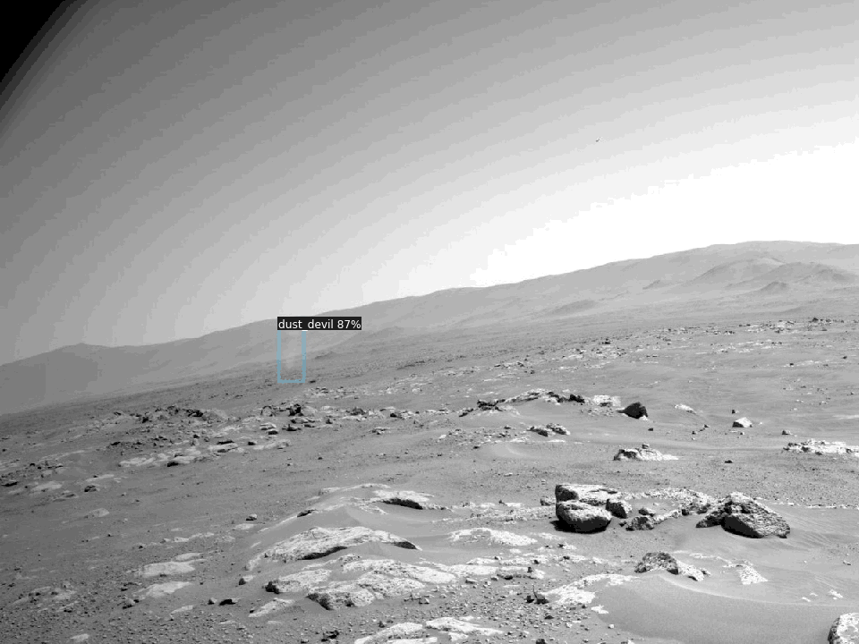
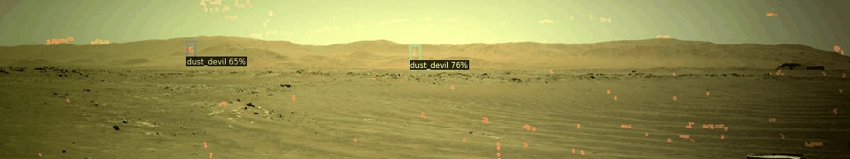
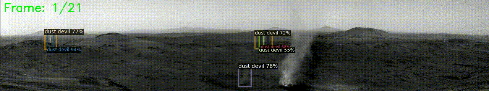
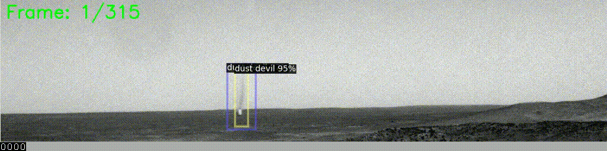

Code for this project is available at https://colab.research.google.com/drive/1AvhT4HxQvM_E4eRYoPp8vAxnbetMMwHz?usp=sharing
Data for Pre-Filter: https://drive.google.com/drive/folders/1UaeeM8G5RnrSvFhYFmtNo9LqtCOz1pur?usp=sharing
Data Used for Training: 
## Overview

Dust devils are vertical vortices that entrain dust from the surface into the atmosphere, occurring frequently on Mars where they play a significant role in the planet's climate system. Traditional detection methods rely on manual inspection of imagery, which is time-intensive and often too late to address potential consequences.

Our research demonstrates the first successful application of Faster R-CNN to detect dust devils in ground-based Martian rover imagery. We show that domain-specific training enables detection of these low-opacity, amorphous phenomena that generic object detection algorithms typically miss.

## Inferred Dust Devil Examples

Below are animated examples of dust devil detections from Perseverance rover imagery. The bounding boxes show the model’s inference across sequential frames, capturing faint and dynamic atmospheric events.

## Our Novel Detections
### Sol 52 – Perseverance

### Sol 57 - Perserverance
.gif)
.gif)

### Sol 102 – Perseverance

### Sol 113 – Perseverance

### Sol 120 – Perseverance

### Sol 153 – Perseverance

## Test Images

### Sol 1398 – Perseverance, NavCam Left

### Sol 1120 – Spirit, NavCam Left

These detections demonstrate the model's ability to localize low-opacity, rapidly changing dust devils that are often imperceptible in static frames. Each GIF contains 3–5 consecutive images used in inference.
## Dataset

Our analysis used 552 images from the Spirit, Opportunity, and Perseverance rovers:
- 407 positive samples (containing dust devils)
- 145 negative samples (without dust devils)

Images were standardized to 640 x 640 pixels and split into training (68%), validation (19%), and testing (13%) sets based on image acquisition scenes to prevent data leakage.

## Performance Results

Our fine-tuned Faster R-CNN model with ResNet-50 backbone and Feature Pyramid Network achieves:

| Metric | Our Fine-tuned Faster R-CNN | Generic Faster R-CNN (R101) | 
|--------|-----------------------------|-----------------------------|
| AP     | 10.50930000                 | 0.00499119                  | 
| AP50   | 39.08530000                 | 0.02084782                  | 
| AP75   | 1.60460000                  | 0.00019552                  | 
| APsmall| 6.58320000                  | 0.00000000                  | 

This significant performance gap demonstrates the importance of domain-specific training for detecting these challenging atmospheric phenomena.

